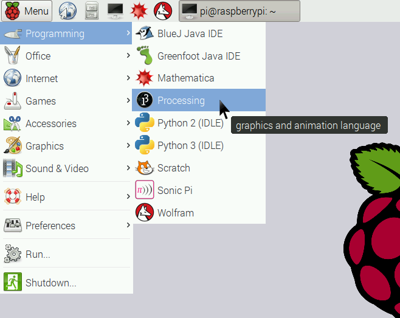
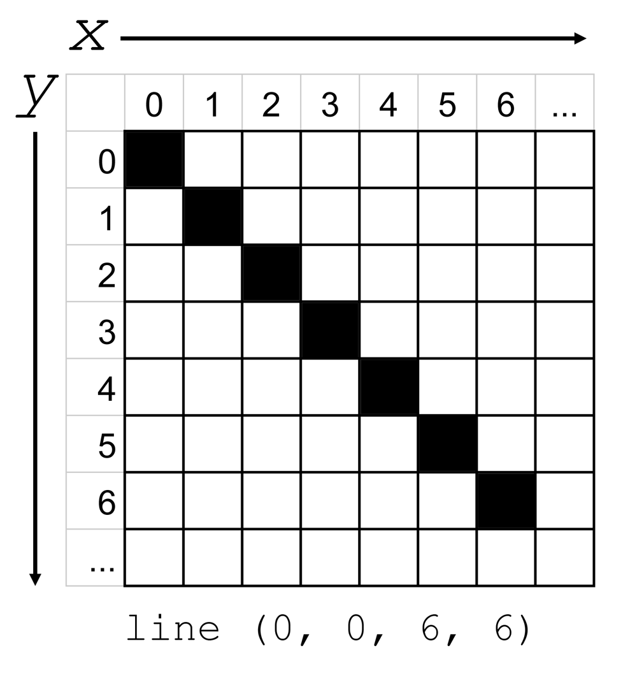
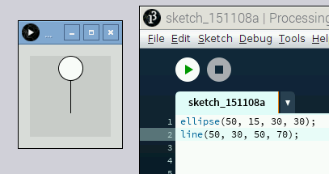
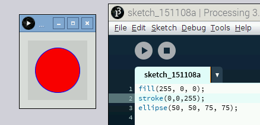

# Introduction

Processing is all about learning to use code to draw on screen. The language is certainly capable of so much more than that, but this tutorial is going to focus on drawing.

1. To start Processing, click on **Menu** -> **Programming** -> **Processing**.



## Write your first Processing sketch

The main Processing window is where you'll type your code, and the **Run** button is how you'll execute that code. In the world of Processing, the program you write is called a **sketch**. Create your first simple sketch:


1. Enter the following code in the window:

	```java
	line(0, 0, 100, 100);
	```

1. Click on the **Run** button. A new window should appear with a box and a diagonal line.

	

	The [line function](https://processing.org/reference/line_.html) draws a line between two points in the window. It takes four inputs: `x1` and `y1` for the start of the line, and `x2` and `y2` for the end of the line. Its syntax is:

	```java
	line(x1, y1, x2, y2);
	```

	To understand what this means, you'll need to know that Processing uses a coordinate system like the one shown below. Note that the numbering begins at 0, not 1. Also, the origin is in the top-left, rather than the bottom-left as you may be used to.

	

1. Try entering different values into the `line` function and press **Run**. Below are a few ideas to try. Can you guess what the output will look like *before* you execute the code?

	```java
	line(0, 50, 100, 50);
	line(50, 0, 50, 100);
	line(90, 10, 10, 90);
	```

1. Processing will execute one line of code at a time, starting at the top of the sketch and working downward. This is called **procedural programming**. Try calling the `line` function a few different times, with a few different values in a single sketch.

1. When you click **Run**, you'll notice that Processing draws each line you entered on the window.

	*Note: Processing will alert you to mistakes or when it can't make sense of a statement because of a syntax error. It will highlight the line and print out helpful information in the Message area and Console at the bottom of the window.*

## Draw other shapes

Of course, you can do a lot with lines, but Processing can draw a lot of different shapes. In these steps, you'll learn how to draw a circle and a rectangle.

1. Enter the following code in a blank sketch and press **Run**:

	```java
	ellipse(50, 15, 30, 30);
	```

	The [ellipse function](https://processing.org/reference/ellipse_.html) draws an ellipse (oval). An ellipse with equal width and height is more commonly known as a circle. The syntax for the `ellipse` function is:

	```java
	ellipse(xPosition, yPosition, width, height);
	```
	
1. Try changing the values of the ellipse and running your sketch, to see how each value affects the shape.

1. If you go back to the original ellipse you drew, it looked like the start of a stick figure, don't you think? Try using the `line` function to draw the rest of the person. Here's a hint to get you started:

	```java
	ellipse(50, 15, 30, 30);
	line(50, 30, 50, 70);
	```

	

1. Even though you can draw a rectangle using just four lines, there's a [rectangle function](https://processing.org/reference/rect_.html) to make it easier. Its syntax is:

	```java
	rect(xPosition, yPosition, width, height);
	```

1. Try drawing a box around your stick figure. At this stage, it's important to note that as your code is executed, Processing draws shapes on top of previously drawn shapes. Therefore, you may want to execute the `rect` function before the code to draw your stick figure.

	*Note: If you ever forget how to use a function, you can always right-click on it in your code and click on "Find in Reference." This will open up a local copy of the Processing reference for that function.*

## Add colour

You may have noticed that the ellipse and rectangle you drew had black outlines and were filled with white. It would be boring if that was the only option, right? In this section, you'll learn how to change the **stroke** (the outline) and the **fill** (the solid colour inside the shape).

There are lots of ways for us to describe colours to a computer. With Processing you'll usually use an **RGB value**, which describes colours by stating how much red, green, and blue are in them.

1. To try it out, run the following code to draw a circle with a red fill:

	```java
	fill(255, 0, 0);
	ellipse(50, 50, 75, 75);
	```

	

	After you call the `fill` function, any shapes drawn after that function will have that colour fill, until you call the `fill` function again with a different colour. The syntax for `fill` is:

	```java
	fill(red, green, blue);
	```
	
	Each primary colour can have the value 0 to 255. 0 means no presence of the colour and 255 is the maximum amount of that colour.

1. Try to change the values of the `fill` function, and re-run your code to try making other colours. Remember that you may need to mix colours together!

1. To change the colour of the outline, use the [stroke function](https://processing.org/reference/stroke_.html). It uses the same colour parameters as the `fill` function:

	```java
	stroke(red, green, blue);
	```

	Try changing the stroke of the circle.

	

1. And if you want to get rid of the stroke or fill, use the [noStroke](https://processing.org/reference/noStroke_.html) and [noFill](https://processing.org/reference/noFill_.html) functions. Keep in mind that if you use them both at the same time, you won't be able to see what you're drawing! Try them out on the circle above.

1. Use what you now know about `fill`, `stroke`, `noFill`, and `noStroke` to draw something like the Olympic rings, a giraffe, or a Raspberry Pi!

	*Note: By default, all lines are 1 pixel wide. To increase the thickness of the line, use the [strokeWeight function](https://processing.org/reference/strokeWeight_.html). As with the colour functions, after you call it, all shapes you draw will have your specified thickness until `noStroke` is called, or `strokeWeight` is called with a different value. The syntax is:*

	```java
	strokeWeight(width);
	```

## Make things move

Up until now, you've been writing sketches that draw a single thing and then they're done, but Processing is a powerful language that lets you create animations and respond to inputs. In this section, you'll learn how to get things to move on screen.

In order to create movement, you'll need to define two special functions: `setup` and `draw`. The code you write in the `setup` function is only executed once when your sketch starts. Afterwards, the code you write in the `draw` function is executed over and over again until you terminate the sketch. This is the basic structure of most of the Processing sketches you'll write:

```java
void setup() {
	// the code here will only be executed once.
}

void draw() {
	// the code here will be executed over and over again.
}
```

1. Enter the following code into a new Processing sketch and run it. The text after the double slashes are comments to help you understand what each line is doing; they'll be ignored by Processing.

	```java
	// Create an integer variable called i and store the value 0 in it:
	int i = 0;

	void setup() {
	  // Create a 500 pixel by 500 pixel window:
	  size(500, 500); 
	}

	void draw() {
	  // Set the background to blue:
	  background(0, 0, 100);

	  // Set the fill to red:
	  fill(255, 0, 0);

	  // Draw a circle. Its y coordinate will be taken from the variable i:
	  ellipse(250, i, 30, 30);

	  // Update the variable i:
	  if (i < height) { // if it's less than the height of the window:
	    i = i + 1; // then add 1 to its value
	  }
	  else { // otherwise (if it's greater than or equal to the height of the window): 
	    i = 0; // set it back to zero.
	  }
	}
	```

	You should see a circle moving downwards. When it gets to the bottom, it resets to the top again. It will move like this forever.

	There are a few new concepts in this sketch. Let's take a closer look now at what's going on.

	The line `int i = 0;` sets up a **variable**; this is a spot in memory to hold an **integer**, which is a whole number. It calls that spot in memory `i` and sets its value to 0. Later in the sketch, your code will read that value and update it.

	When Processing draws the ellipse in the line `ellipse(250, i, 30, 30);`, it uses the current value of `i` as the y coordinate for the circle.

	

1. Further down, the line `i = i + 1;` sets a new value for `i`, incrementing it by 1. Try changing that line to `i = i + 2;`. What do you think will happen when you run the sketch? Also try `i = i + 5;`.

1. The line that changes the value of `i` is wrapped up in an **if/else statement**. It checks to see if the value of `i` is greater than the height of the window. If it is, it sets the value back to zero. This ensures that the circle goes back to the top of the window after it has moved to the bottom. Try adjusting the `if/else` statement and the line that updates the value of `i`, to make the ball move upwards repeatedly.

1. The line `background(0, 0, 100);` fills the window with blue. The [background function](https://processing.org/reference/background_.html) takes red, green, and blue parameters, just like other functions that deal with colour. It's important to call this function at the start of every draw block if you want the previously drawn circles cleared from the window. Try running the sketch without the background function to see the effect.

1. Try to work with variables and other parameters such as x position, colour, height, and width.

## Respond to the mouse

There are many ways to have a Processing sketch listen to inputs to make it interactive; the mouse is just one way. In this section, you'll learn how to listen for mouse clicks and get the position of the mouse.

1. Create a new sketch with the following code:

	```java
	int x = 0;
	int y = 0;

	void setup() {
	 size(500, 500);

	 // Set the value of x to be half the width of the window
	 x = width / 2;

	 // Set the value of y to be half the height of the window
	 y = height / 2;
	}

	void draw () {
	 background(0, 100, 0);

	 // Draw the circle in the position taken from the x and y variables:
	 ellipse(x, y, 50, 50);
	}

	void mousePressed() {
	  // When the mouse is pressed, update x and y
	  // to contain the current position of the mouse:
	  x = mouseX;
	  y = mouseY;
	}
	```

	The code above uses a few special variables that all Processing sketches have "built-in": `height`, `width`, `mouseX`, and `mouseY`. The `height` and `width` variables refer to the height and width of the window. The `mouseX` and `mouseY` variables contain the position of the mouse pointer.
	
	*Note: You also used the `height` variable in the previous sketch, to check the position of the circle in relation to the bottom of the window.*

	The code also creates a special function called `mousePressed()` that is executed when either mouse button is pressed. 

1. Run the sketch and click anywhere in the window to see the circle move to that position!

	

1. Try updating the code to use `mouseX`, `mouseY`, and `mousePressed` to change the size or colour of a shape.

## What next?

These are just the very basics of drawing onscreen using code; there are many more functions to try. You can see a listing of them in the [Reference section of Processing.org](https://processing.org/reference/).

We also recommend that you explore the example code that's included with Processing. Click **File** -> **Examples** to open the example browser.

Processing for Raspberry Pi has been enhanced to use the Pi's GPIO pins. If you're interested in adding some physical interactivity to your project, then move onto [the next tutorial here](worksheet-2.md).
